# System Architecture Diagram

## High-Level Architecture

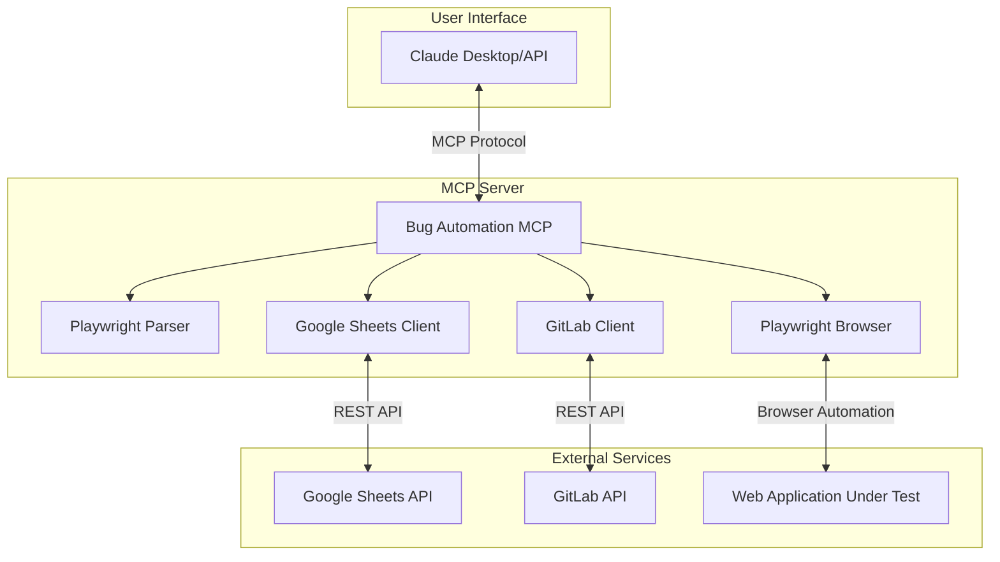

## Data Flow - Bug Reproduction

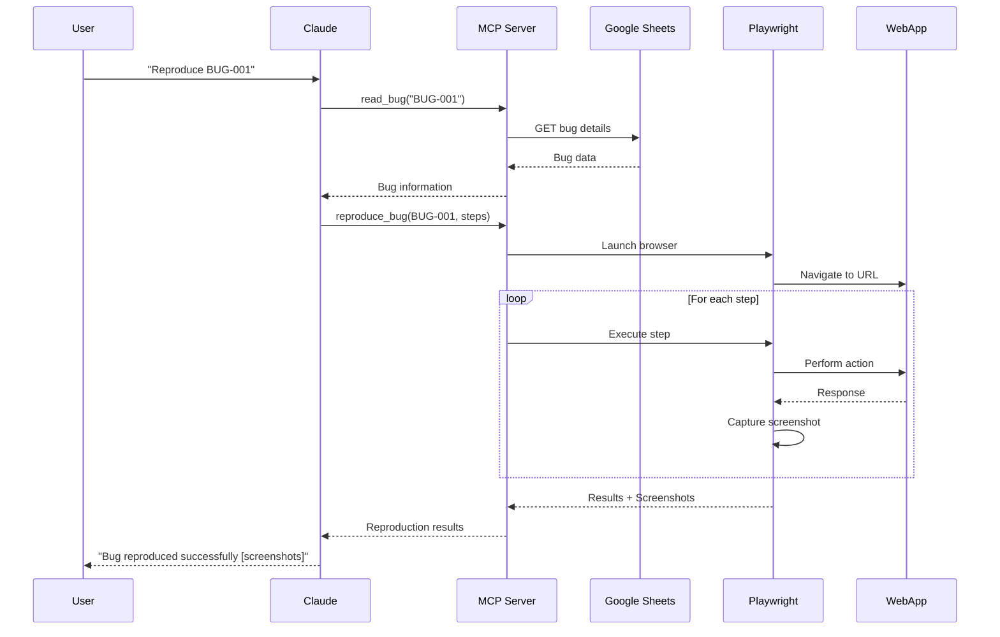

## Data Flow - Fix and Commit

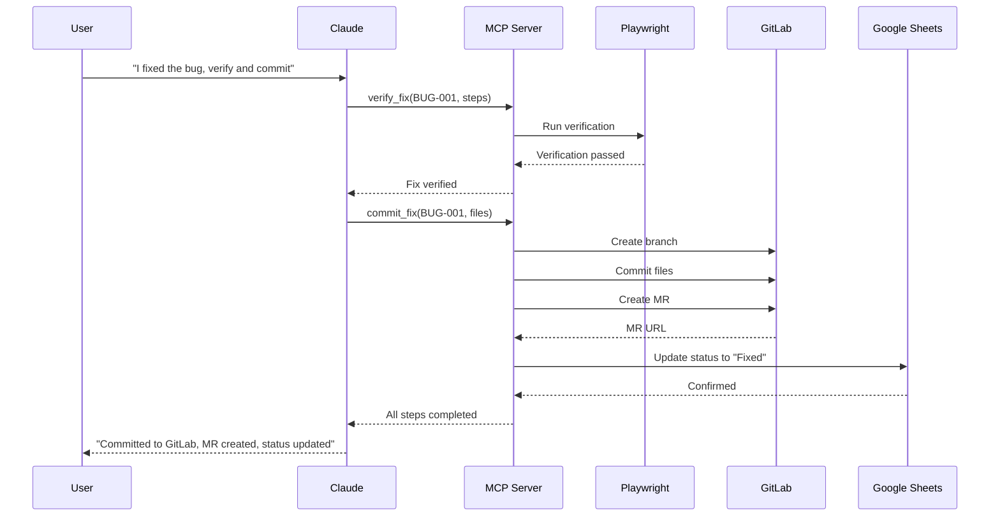

## Component Interaction

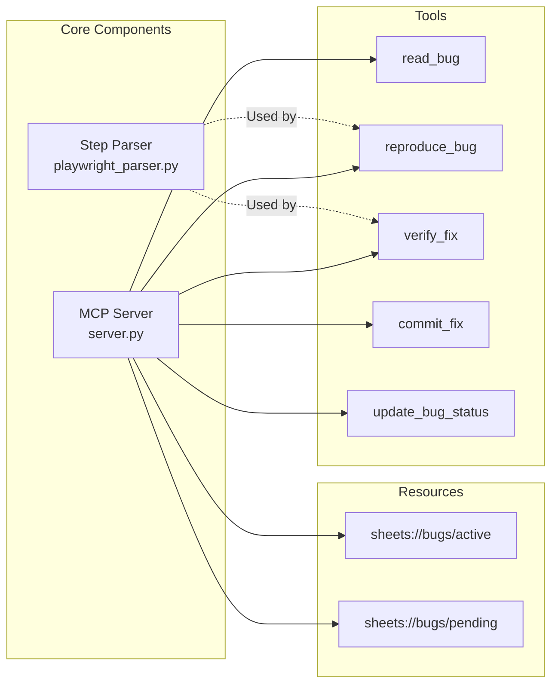

## Playwright Step Parsing Flow

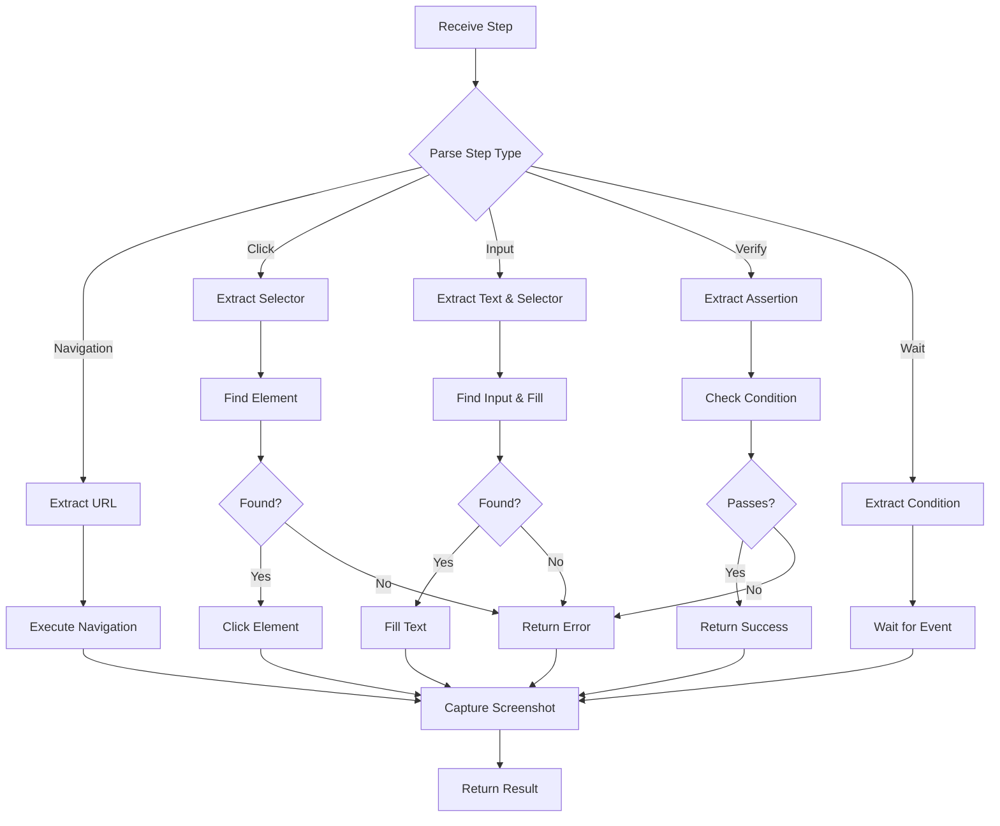

## State Transitions

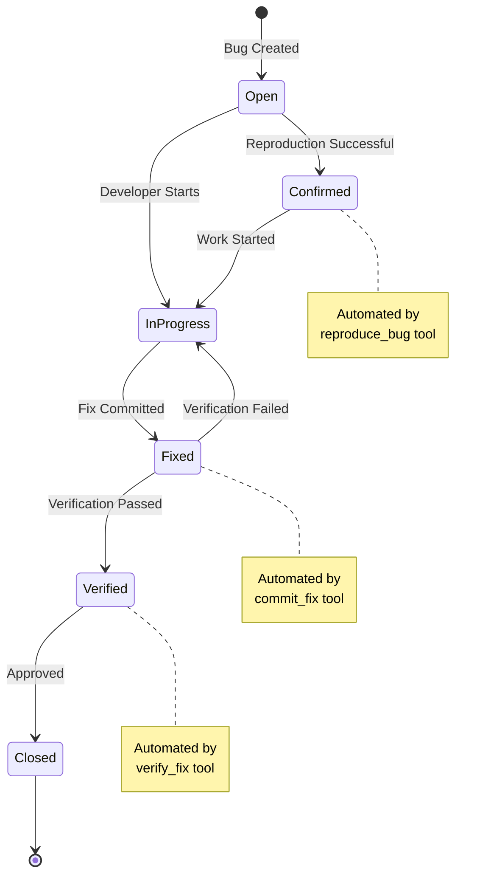

## Google Sheets Schema

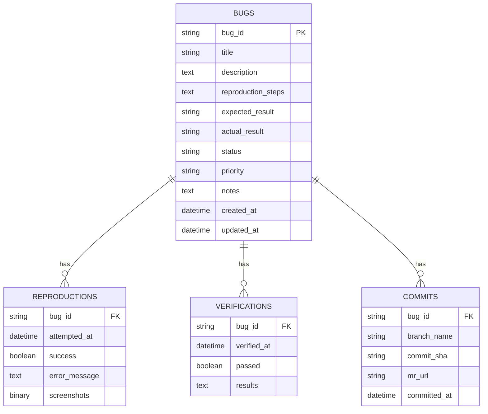

## Security Model

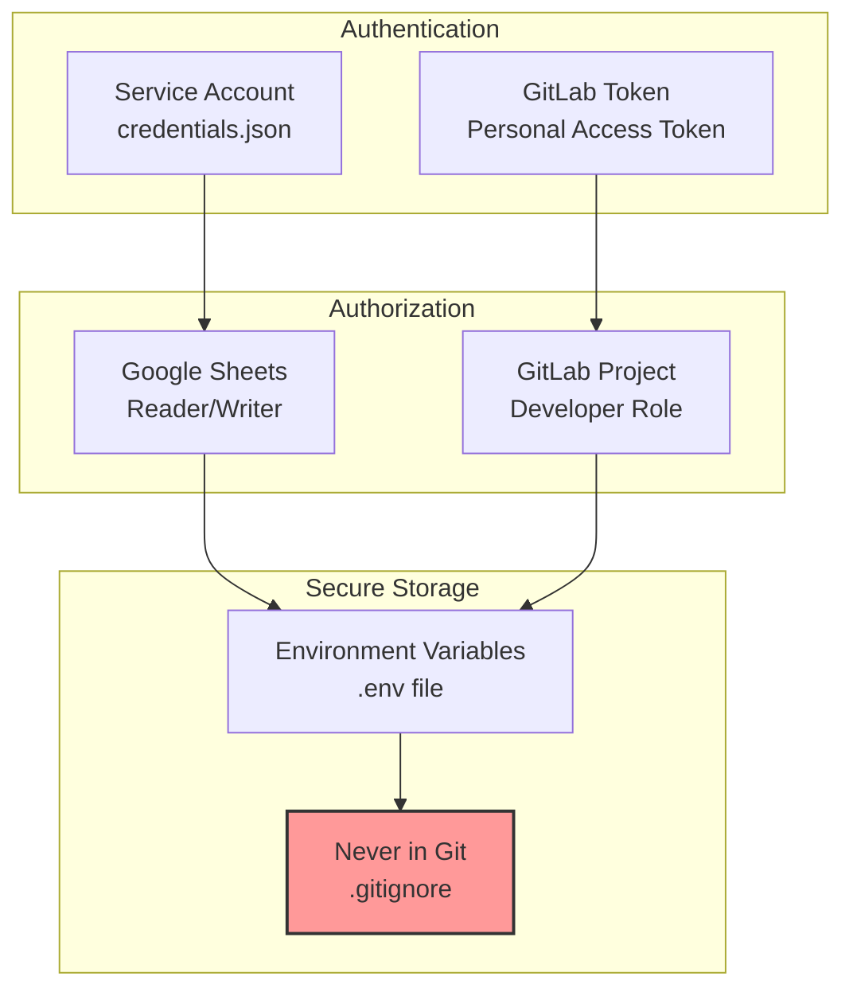

## Deployment Options

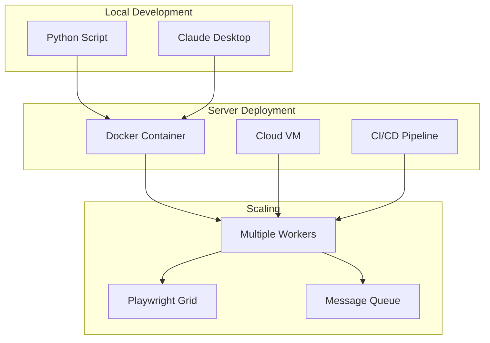

## Tool Call Sequence

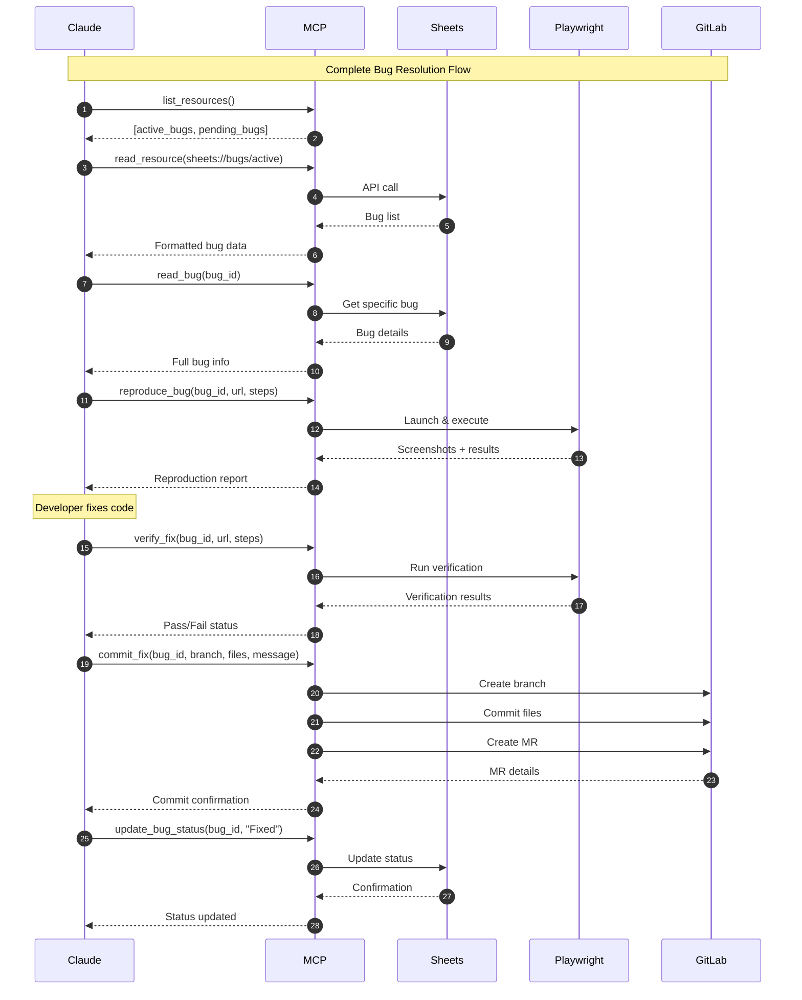

## Error Handling Flow

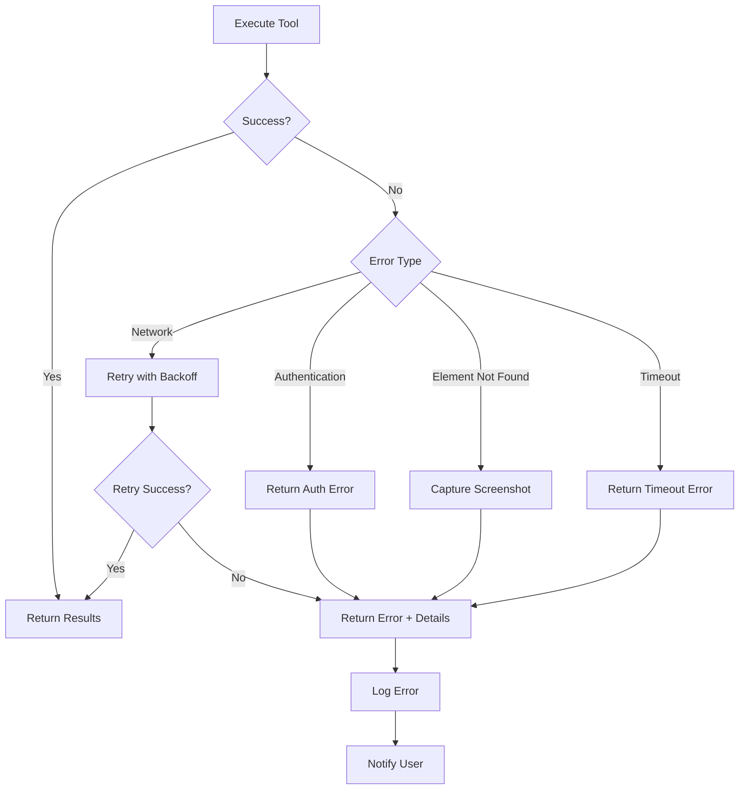

## Legend

- **MCP Protocol**: Model Context Protocol for communication
- **REST API**: Standard HTTP REST endpoints
- **Browser Automation**: Playwright WebDriver protocol
- **Async/Await**: All operations are asynchronous
- **Error Handling**: Comprehensive error catching and reporting
- **Screenshots**: Captured at key points for debugging

---

These diagrams show the complete system architecture and data flows. Use them to:
- Understand component interactions
- Debug issues
- Plan enhancements
- Onboard new developers
